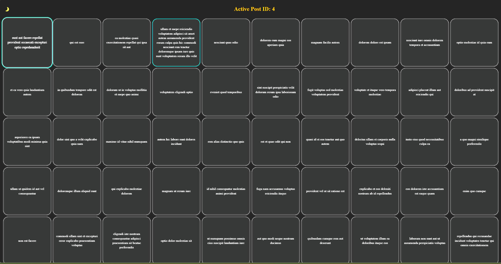

✅ Angular Posts Grid App

A responsive Angular 19 application that fetches 100 posts from JSONPlaceholder and displays them in a 10x10 grid layout. This project showcases advanced Angular 19 features like standalone components, signals, NgRx state management, and Jest testing, built with a modern Airbnb-style responsive UI.

you can check the site at

https://itaishopen.github.io/angular-posts/

📸 Demo

🚀 Features

✅ Built with Angular 19 standalone components

⚡ Uses Signals for reactive state management

✅ NgRx for handling global state and effects

✅ Unit tested with Jest

✅ build to WCAG 2.1 AA compliance for accessibility

🎨 Responsive 10x10 grid with hover and click animations

🌓 Dark/Light mode toggle with animated SVG lamp icon

💡 Clickable squares cycle through post details: title → userId → id → body

🔁 trackBy used in @For for optimal DOM rendering

📦 Tech Stack
Frontend: Angular 19, Signals, NgRx, SCSS

State Management: NgRx (Store, Effects, Selectors)

Testing: Jest

Design: CSS Grid, Airbnb-style responsive layout

API: JSONPlaceholder

git clone https://github.com/itaishopen/angular-posts.git

cd angular-posts

npm install

ng serve

📱 Responsive Design

Uses CSS Grid to adapt the layout responsively.

On large screens: 10x10 layout.

On smaller screens: collapses into an intuitive stacked layout similar to Airbnb's card responsiveness.

👤 Author
Itai Shopen
Senior Frontend Developer | Angular Specialist

https://www.linkedin.com/in/itai-shopen/

📝 License
MIT License. Feel free to fork, modify, and build on it!
